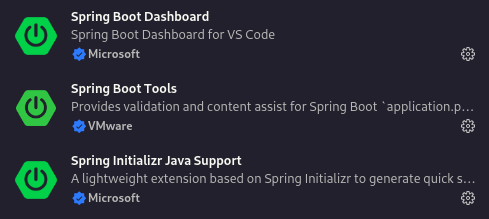

# Trabalho Final POO
Este repositório trata-se do trabalho final da disciplina POO - Programação Orientada a Objetos.

## Como executar
👉 Primeiramente, faça um clone do repositório:

```git clone https://github.com/mfelipesoares/Trabalho_Final_POO.git```

👉 Abra o diretório no VSCode:
  
```cd Trabalho_Final_POO && code . ```

👉 Instale as seguintes extensões:


