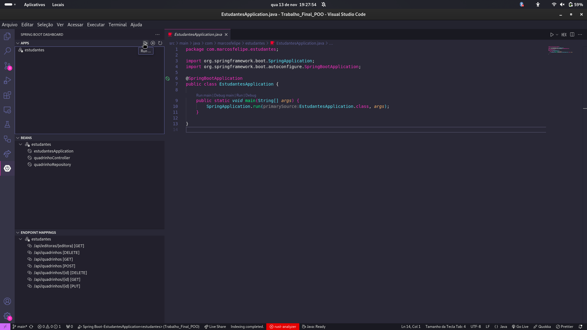

# Trabalho Final POO
Este repositório trata-se do trabalho final da disciplina POO - Programação Orientada a Objetos.

## Configurando o Postgres no Docker:

👉 Execute:

1 - ```docker pull postgres```

2 - ```docker pull dpage/pgadmin4```

3 - ```docker network create --driver bridge postgres-network```

4 - ```docker run --name teste-postgres --network=postgres-network -e "POSTGRES_PASSWORD=senha123" -p 5432:5432 -v /home/$(whoami)/Documentos/PostgreSQL:/var/lib/postgresql/data -d postgres ```

5 - ```docker run --name teste-pgadmin --network=postgres-network -p 15432:80 -e "PGADMIN_DEFAULT_EMAIL=email@email.com -e "PGADMIN_DEFAULT_PASSWORD=senha123" -d dpage/pgadmin4```

## Como executar

👉 Primeiramente, faça um clone do repositório:

```git clone https://github.com/mfelipesoares/Trabalho_Final_POO.git```

👉 Abra o diretório no VSCode:
  
```cd Trabalho_Final_POO && code . ```

👉 Instale as seguintes extensões:


👉 Execute o programa:


